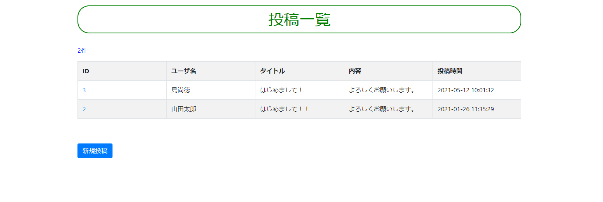

# bbs_comment_mvc
あえてPHPフレームワークLaravelを使わないで作成した、シンプルな写真投稿サイトです。

写真に名前とタイトルと一言（内容）を添えて新規投稿することができます。

選択画像はJavaScriptでプレビュー表示をしています。また、投稿に対してコメントすることもできます。

投稿する際に任意のパスワードを設定することで、編集・削除をする際にパスワード入力を促します。

MVCの思想にのっとり、Model/View/Controllerを自作し連携させています。

ファイルの名前、およびModelのCRUDメソッドはLaravel風に命名して自作しました。

テーブルは2つで構成されており、そのテーブル間のアソシエーションは1対多のみ実装しています。

レイアウトには簡便的に Bootstrapを使っています。

## 技術要素

- 開発環境 AWS Cloud9/Amazon Linux
- HTML5/CSS3
- bootstrap 4.3.1
- JavaScript/jQuery
- PHP 5.6.40
- mysql Ver 14.14 Distrib 5.5.62
- PDO
- バージョン管理 Git/Github
- デプロイ Xfree/Heroku

## 機能一覧

- パスワード付画像投稿機能
- 投稿一覧表示機能
- 投稿詳細表示機能
- 投稿編集・削除機能（新規投稿時に設定したパスワード入力必要）
- 投稿に対するコメント投稿機能
- 投稿に対するコメント一覧表示機能
- 各種フラッシュメッセージ表示機能
- 入力値に関するバリデーション機能
- 不正アクセス防止機能

## 実行画面の様子

トップ画面

## エピソード

レッスン用のサンプル教材として作成しました。

このサンプルをもとに、以下のような様々な拡張にチャレンジしてみるもの面白いかと思います。

- 会員登録・ログイン・ログアウト機能
- プロフィール編集機能
- いいね機能
- フォロー機能
- 会員間のでダイレクトメッセージ機能
- グループチャット機能

環境設定手順、SQLファイルはmemosフォルダ内にありますので、同じ環境を構築していただき、データをimportしてご利用ください。

また本番環境で動かすには、以下の設定ファイルを書き換えた上でデプロイしてください。

config/const.php

まだまだ不勉強なためバグが潜んでいるかもしれません。改善点などがありましたら、ご連絡いただけると幸いです。

quark2galxy@gmail.com

## 著者
2021/05/13 Takanori Shima
